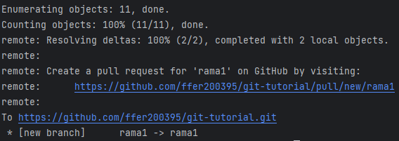

# Tutorial del uso de git

## Primeros pasos
- Crear un directorio para el proyecto que vamos a iniciar.
- Abrir el proyecto en ese directorio desde pycharm
- Una vez abierto ejecutar en la terminal de pycharm:
```
git init
```
Si todo ha funcionado correctamente nos aparecerá un mensaje parecido a este:


## Conexión a github (Repositorio remoto)
Queremos que nuestro amigo pueda ver este archivo que estamos creando y queremos practicar con él.
Para ello debemos primeramente debemos de crear el repositorio remoto en Github. Una vez hecho copiamos la URL del repositorio y lo usamos en el siguiente comando:
```
git remote add origin https://github.com/ffer200395/git-tutorial.git
```
De esta forma estamos conectando nuestro repositorio local con uno remoto 'origin' es el alias con el que nos vamos a referir al directorio remoto.
Si tras ejecutar el comando nos vamos al repositorio remoto en github veremos que sigue intacto ya que hasta ahora solo hemos enlazado nuestro repositorio local con el repositorio remoto pero aún no hemos dicho que queremos guardar y subir los cambios realizados hasta ahora.

## Guardar cambios (Add y Commit)
Imaginemos que no queremos grabar todos los cambios entonces con git add indicaríamos que archivos de los que hemos modificado se deben tener en cuenta.
Posteriormente procedemos ha hacer el registro de ese "guardado de cambios" con n commit. En caso de que quisiéramos tener en cuenta todos los archivos que se han modificado usaríamos git add .

```
git add .
git commit -m "Guardando cambios iniciales del README"
```
Si todo ha sido correcto deberíamos de ver en pantalla un mensaje que informa acerca de los cambios:


## Subir cambios (push)
Mediante el comando git push debemos indicar el nombre del repositorio así como la rama local desde la cual queremos hacer el push.
Recordemos que **origin** es el alias que le pusimos al repositorio remoto cuando lo enlazamos con el local, **master** es el alias de la rama que se crea automáticamente.
```
git push -u origin master
```
Cuando utilizas -u en este comando, le estás indicando a Git que, después de realizar con éxito 
el git push, quieres que establezca la rama local master para hacer un seguimiento de la rama
remota master en el control remoto origin. Esto significa que en futuros git push y git pull, 
Git sabrá automáticamente qué rama local está relacionada con qué rama remota y realizará las 
operaciones de manera adecuada sin que tengas que especificar explícitamente las ramas cada vez.

Si se ha realizado correctamente veríamos algo así:


Ahora sí que podremos ver el proyecto en nuestro repositorio en github.

## Crear una nueva rama (branch)
Imaginemos que vamos a trabajar en otra funcionalidad del proyecto y queremos desarrollarla aparte de modo que una vez desarrollada podamos integrarla con la rama principal del proyecto.

Para ello ejecutaremos el comando git branch seguido del nombre de la rama que vamos a crear:
```
git branch rama1
```
Posteriormente, para colocarnos en la rama que acabamos de crear debemos ejecutar el comando git checkout seguido del nombre de la rama:
```
git checkout rama1
```
Al cambiarnos de rama veríamos este mensaje:


Tras realizar los cambios convenientes desde la rama 1 podemos hacer un commit y push para que quede registro del trabajo realizado en esa rama, por lo que una vez terminado el trabajo dentro de la misma rama 1 ejecutamos:
```
git add .
git commit -m "Primeros cambios desde la rama 1"
git push origin rama1
```
Tras hacer el commit en la nueva rama deberíamos ver un mensaje parecido al siguiente:


Si quisieramos ver los cambios realizados y subidos desde esta rama en el repositorio remoto de github debemos indicar desde qué rama queremos ver el proyecto:


Todos los cambios realizados hasta ahora en la rama1 serán invisibles desde la rama master a menos que hagamos una fusión de ambas versiones.

Hay que tener en cuenta que si después de los cambios realizados en la rama1 (tras hacer el commit y push) cambiamos a la rama master, el archivo que estemos tocando se restaurará a la última versión registrada para la rama master.

## Mergear cambios realizados en distintas ramas (merge)

Si tras haber realizado cambios sobre el mismo archivo tanto desde la rama master como la rama1 queremos hacer un merge obtendremos un mensaje de conflicto parecido al siguiente:


En el caso de presentar conflictos debemos solventarlo manualmente, posteriormente hacer git add, commit y por último merge. Tras realizar el merge veremos lo siguiente:

```
git merge rama1
```


## Pull request

Permite a los colaboradores de un proyecto proponer cambios en un repositorio y solicitar que el propietario del repositorio original los integre. Proceso de una pull request:

- Crear rama para la nueva funcionalidad.
- Realizar cambios.
- Hacer commits.
- Hacer push de los cambios al repositorio remoto desde la rama.
- Crear una pull request: En GitHub, navegas a tu repositorio y seleccionas la opción para crear una pull request. Debes seleccionar la rama de la que deseas fusionar tus cambios y la rama de destino en el repositorio original (por ejemplo, la rama master).
- Revisión y discusión.
- Integración de la pull request: El propietario del repositorio original puede fusionar la pull request. Esto significa que tus cambios se incorporarán a la rama de destino del repositorio original.