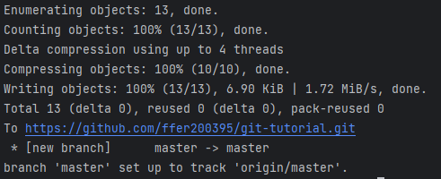

# Tutorial del uso de git

## Primeros pasos
- Crear un directorio para el proyecto que vamos a iniciar.
- Abrir el proyecto en ese directorio desde pycharm
- Una vez abierto ejecutar en la terminal de pycharm:
```
git init
```
Si todo ha funcionado correctamente nos aparecerá un mensaje parecido a este:


## Conexión a github (Repositorio remoto)
Queremos que nuestro amigo pueda ver este archivo que estamos creando y queremos practicar con él.
Para ello debemos primeramente debemos de crear el repositorio remoto en Github. Una vez hecho copiamos la URL del repositorio y lo usamos en el siguiente comando:
```
git remote add origin https://github.com/ffer200395/git-tutorial.git
```
De esta forma estamos conectando nuestro repositorio local con uno remoto 'origin' es el alias con el que nos vamos a referir al directorio remoto.
Si tras ejecutar el comando nos vamos al repositorio remoto en github veremos que sigue intacto ya que hasta ahora solo hemos enlazado nuestro repositorio local con el repositorio remoto pero aún no hemos dicho que queremos guardar y subir los cambios realizados hasta ahora.

## Guardar cambios (Add y Commit)
Imaginemos que no queremos grabar todos los cambios entonces con git add indicaríamos que archivos de los que hemos modificado se deben tener en cuenta.
Posteriormente procedemos ha hacer el registro de ese "guardado de cambios" con n commit. En caso de que quisiéramos tener en cuenta todos los archivos que se han modificado usaríamos git add .

```
git add .
git commit -m "Guardando cambios iniciales del README"
```
Si todo ha sido correcto deberíamos de ver en pantalla un mensaje que informa acerca de los cambios:


## Subir cambios (push)
Mediante el comando git push debemos indicar el nombre del repositorio así como la rama local desde la cual queremos hacer el push.
Recordemos que **origin** es el alias que le pusimos al repositorio remoto cuando lo enlazamos con el local, **master** es el alias de la rama que se crea automáticamente.
```
git push -u origin master
```
Cuando utilizas -u en este comando, le estás indicando a Git que, después de realizar con éxito 
el git push, quieres que establezca la rama local master para hacer un seguimiento de la rama
remota master en el control remoto origin. Esto significa que en futuros git push y git pull, 
Git sabrá automáticamente qué rama local está relacionada con qué rama remota y realizará las 
operaciones de manera adecuada sin que tengas que especificar explícitamente las ramas cada vez.

Si se ha realizado correctamente veríamos algo así:


Ahora sí que podremos ver el proyecto en nuestro repositorio en github.


